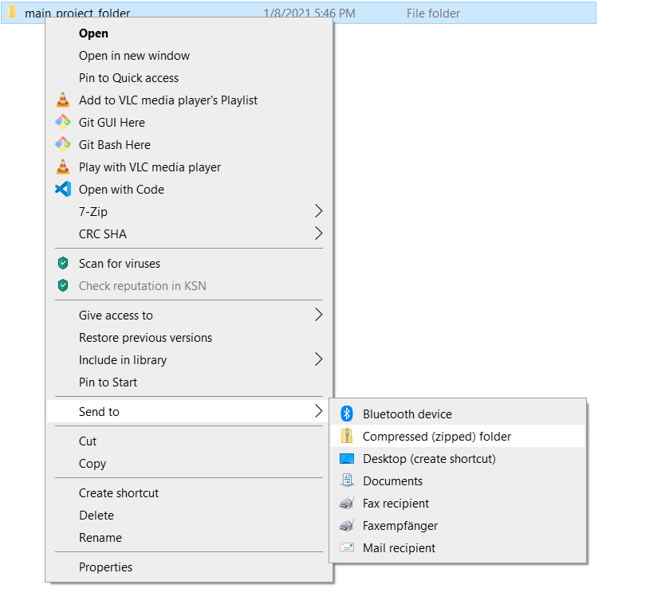
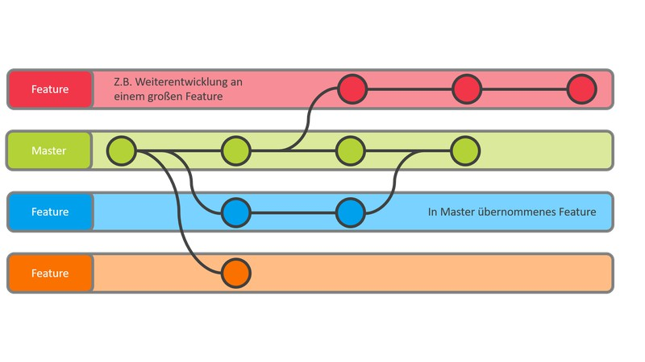

# Collaboration and reproducible research

In science, you will rarely work alone on a project (at least you shouldn't). This is true whether you are an early career scientist or a senior researcher. Ideally, your collaborators will be present at every stage of project; this includes the data analysis stage. However, it's often difficult to share what you are working on. A script is easy enough to share, but what good does it do without data? How can you get instructions that you wrote for your computer to work on someone else's?


## Making your project reproducible

### R projects

Since we've already covered this, I won't discuss this topic so much.

A few key reminders:

-   The .Rproj file can serve as a shortcut to opening the project into R Studio
-   R projects can help you organize the project structure (they're not necessary to do this, though)
-   R projects store settings - do you want to save your environment when closing? - do you want to start a session with a clean environment?
-   Relative, not absolute, paths!!!

### `set.seed()`

In short, the `set.seed()` function makes your code reproducible. So, if you include a seed in your code, any random process will produce the same output every time you run your script. And it should produce the same output on other computers, as well.

You should include `set.seed()` if your script includes any random processes. What are some examples of random processes?

-   `rnorm()`, `runif()`, `rpois()`, etc.
-   `sample()`
-   `subset()`

If you are unsure whether you should include `set.seed()` in your script, include it.

::: {.tmi}
**TMI**: Randomness is a tricky concept. True randomness is difficult to find. Most things that we think of as random are actually "pseudo-random", i.e., fake random. In reality, these processes are "deterministic" - which means that they will produce the same result if given the same input. We think of them as random because we lack knowledge about the inputs.

Computers are definitely deterministic. So, how do we get a deterministic machine to produce randomness? Well, we don't. We get it to produce pseudo-randomness. They use complex algorithms to produce outputs that seem to be random. In reality, they are completely deterministic. The "seed" serves as the starting point.
:::

### Commenting your code

Comments are lines of code that are not evaluated by the computer but can be read by humans. You can use them to leave notes or explanations for anyone who reads your code (including future you). When you should write a comment is not an exact science (and some programmers don't like them unless absolutely necessary). Essentially, you should leave a comment anytime you think something might be confusing or unclear. Ideally, they should be clear and concise - but this is a bit of a [drawing the owl](https://www.reddit.com/r/funny/comments/eccj2/how_to_draw_an_owl/) recommendation. Commenting probably won't be intuitive early on, but at this stage I would lean towards over-commenting rather than under-commenting (just don't comment every line :) )

In R, the computer doesn't evaluate anything on a line that comes after the `#` symbol.

## Saving your workspace

It is possible to save the objects that you create in your environment by using the function `save.image()`. Use the extension .RData in your file name and then you can easily reload your objects. You can set up R Studio to always save your workspace when it closes and then load the workspace/environment when you open the project (or even just R Studio).

```{r}
x <- 'some_variable'
variable_in_workspace <- 6

ls()
```

```{r}
save.image(file = '../data/workspace.RData')
rm(list=ls()) # remove all objects
```

```{r}
ls()
```

```{r}
load("../data/workspace.RData")
ls()
```

*NOTE*: I would recommend against saving your workspace unless you have a clear purpose for doing so. Early on in your R career you are likely to create a lot of objects that are not what you want or expect. People often don't clean their environment and then save the workspace leading to messy environments that take up a ton of storage space. Also, a lot of early R users rely too much on previously created objects, oftentimes at the expense of scripts. If you don't write everything in a script you can run into the problem of having an object where you have no idea how you created it. Maybe you can go back through your .Rhistory log, but this is tedious and time consuming.

Even if you do write your code in a script, you will always make changes. Let's say you decide to delete a line of code that creates an objects that you now realize is superfluous. If you save everything in a script and don't save the workspace, then you don't have to worry about that object ever again. If, however, you save and load the workspace every session, the object is still there. Maybe this isn't a big deal and only has the effect of taking up a small amount of memory space. BUT you run the risk of getting weird errors that are hard to track down.

For example, let's say that you accidentally use that variable name somewhere in the script. Small typos happen like this all the time. If that object is still in your workspace, R will use it. If you are lucky, something weird will happen that makes you go back through your code. If you are not lucky, you may end up never catching the mistake and producing false results.

```{r}
## line of code in previous version of script
pop_usa <- c(4, 3, 4, 2, 3, 1)
```

Workspace loaded on start up. Object `pop_usa` is still in environment. During your R career, you will make typos and you will use the wrong variable names.

```{r}
pop_aus <- c(8, 7, 9, 3, 5, 8)

## typo using old variable name
mean_aus <- mean(pop_usa)
mean_aus
```

But, if the variable doesn't exist, R will help you out and throw you an error message. That's a pretty easy mistake to track down and correct.

Clean workspace

```{r}
rm(pop_usa, mean_aus, pop_aus)
```

```{r error=TRUE}
pop_aus <- c(8, 7, 9, 3, 5, 8)

## typo using old variable name
mean_aus <- mean(pop_usa)
mean_aus
```

You never like to see an error message, but it's preferable to having an error and not seeing one.

Furthermore, it's entirely possible that you may reuse the variable name. If everything goes according to plan then, great! But what if your new line of code doesn't work?

```{r}
## line of code in previous version of script
pop_usa <- c(4, 3, 4, 2, 3, 1)
```

Workspace loaded on start up. Object `pop_usa` is still in environment.

```{r error = TRUE}
## reusing variable name with typo
pop_usa <- c(4, 3, 4, 2, , 4)
mean(pop_usa)
```

Because there was an error, the previous data was not overridden in the `pop_usa` object. Because we only have a few lines of code, it's clear that there is an error. But most scripts will be much longer and complex. With multiple warnings and messages it's easy to overlook the important error message. If the object doesn't exist, however, the script will fail allowing you to more easily diagnose the problem.

When should you save your workspace?

The clearest case is when you have a process that takes a lot of time. For example, some complex models may take days to run. You definitely don't want to re-run the model. So, there is a benefit to saving.

It's also useful once you've completed a project or completed an important stage of the project. So, maybe you have a script that processes raw data into a well-organized data frame or data frames. In next step you will analyze the data but re-running the data processing part every time you open the project is a bit annoying. Essentially, you want to save the output of code that you don't plan on modifying again. Of course, this doesn't mean that you can't modify it at some point (and more than likely, you will still have modify the code at some point), but you should think of it as a clear and well-defined stage in the project process rather than something habitual. This means that you should include the `save.image()` and `load()` functions as part of the script.

You can also save the workspace to make collaborating or getting feedback easier. If you have a question about a component of your project, it may be easier to include an .RData file that has your workspace and then the small bit of code that you are interested in.

## Sharing with collaborators

So, that brings us to the crucial question. How do you share your R projects, R scripts, data, etc with collaborators?

### Email

The easiest way is via email. If you are using an R project, find the folder where the .Rproj file is saved. Even if you aren't using an R project, you should have a project folder with some organizational structure. Compress the main folder into a zip file. Both Windows and Macs allow you to compress folders by right clicking and selecting the compress option (for Windows 10 it's Right click \> Send to \> Compressed (zipped) folder, on a Mac it's Right click \> Compress).



Zipping will maintain the structure of your project folder. Your collaborator can then unzip the files and have access to your project code and data by opening the .Rproj file in R Studio. If they don't use R Studio they will still have access to your scripts, data, and saved workspaces.

### File storage

ucloud, Dropbox, Microsoft OneDrive, Google Drive, etc. allow you save and share your project documents.

### Version control

File hosting and sending links are helpful, but if multiple people are actively working on a project, you may run into file conflicts. You also often grow a large number of past version.


Programs like Git and hosting platforms like Github can streamline collaborative work and help researchers document project changes. We don't have enough time to go into great detail, but I'll introduce you to the core concepts.

#### Git

[Git](https://git-scm.com) is a version control system. A version control system tracks changes of a project across time. With Git you can always return to a previous version of the project so if something goes wrong, you can always return to a stable version. For collaborative research this is extremely helpful because it allows researchers to log changes to a project while maintaining clear organizational structure. Git also helps researchers work independently and test their ideas without disturbing the main documents in the project. Git keeps a log of changes to a project, who made changes, and when the changes were made. So, researchers can work simultaneously while minimizing redundancy.



Git allows you to log changes by using **commits**. You can test ideas and make changes to the project just like normal, but they won't become part of the project until you commit the changes (new files, modified files, deletions, etc). You can also create a **branch**. A branch creates a copy of the project at that time (almost like a parallel universe branch off). You can then work on that side branch without disturbing the main branch. If you decide to keep what you were working on, then you can **merge** the side branch and the main branch together. You can do all of this, even on a project that doesn't have collaborators. In fact, Git deal with a project locally (on your computer). In order to work collaboratively with Git, you need someway to share your files.

#### Github

[Github](https://github.com) is file hosting site that is built to work with Git. You can download projects, modify them on your computer, and request that the repository (the project) owner accept your changes.

## R Markdown

R Markdown is a document format that allows you to combine code, the output of the code, and text. You can use R Markdown to create notebooks which allow you to run code. You can also compile the R Markdown document into a html, word, or pdf file so that you can show your code and code output, mathematical formulas, and text all in one place (without having to copy and paste).

You can use R Markdown files to create a report for your collaborators, adviser, or lab that demonstrates each step in your analysis, the code you used, and your results.

You can also use it as a notebook for yourself. An R script only has code and your comments. In the learning process you might want to try some functions and document what they do or how they behave under certain condition. You can put comments into an R script, but an R markdown file allows you to actually see the output of the code.

If you are using R studio, you already have R Markdown installed. To create an R Markdown file go to: `File > New File > R Markdown...`. A dialog box will open where you can select your output format.

## Asking questions

You can always ask questions on forums like [Stack Overflow](https://stackoverflow.com) and [Cross Validated](https://stats.stackexchange.com). Both are part of the [Stack Exchange](https://stackexchange.com) network. These are open communities where users can ask and answer questions related to coding (Stack Overflow) or statistics (Cross Validated). Some members can be... um... a bit prickly, but if you adhere to the community guidelines you will be fine. For the most part, you will likely not even need to ask a question because it's likely already been asked and answered. In fact, one reason that people get upset on these sites is if someone asks a question that has already been answered. If you do ask a question, make sure that you give the community enough information to be able to reproduce your problem. This is known as a **minimal reproducible example (MRE)**. An MRE includes:

-   data, preferably a small subset, that can be used to reproduce the error
-   script or bit of code that's giving your problems
-   information on the R version, any packages used, the operating system (mac, windows 10, etc.) + you can easily get this information by using the function `sessionInfo()`
-   value used in in set.seed() (if any)

Websites for R:

-   R-bloggers: <https://www.r-bloggers.com>
-   Cookbook for R: <http://www.cookbook-r.com>
-   Quick-R: <https://www.statmethods.net>
-   **R for Data Science** by Hadley Wickham & Garret Grolemund: <https://r4ds.had.co.nz>
-   **Advanced R** by Hadley Wickham: <https://adv-r.hadley.nz>

Websites for Stats:

-   **Applied Statistics with R** by David Dalpiaz: <https://daviddalpiaz.github.io/appliedstats/>
-   Visualizing Statistics, University of British Columbia: <https://www.zoology.ubc.ca/~whitlock/Kingfisher/KFhomepage.htm>
-   **Introduction to Statistics using R** by Tom Booth, Anastasia Ushakova, & Milan Valasek: <https://bookdown.org/animestina/intro_stats_rms/>

```{r include=FALSE}
date <- "2021-01-09"
```

```{r, child="_session-info.Rmd"}
```
